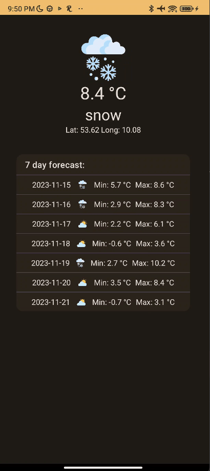

# Tomorrow coding challenge
Implementation of a simple weather app based on the challenge's design concept, built with Jetpack Compose

### Screenshots

### Architecture
The app has a simple Clean architecture implementation with MVVM architecture.
core: package containing the core functionalities, like data layer, domain models and network implementation
feature: single presentation layer

## Solution
The solution uses a single screen [WeatherScreen](app/src/main/java/com/novack/tomorrowcodingchallenge/feature/weather/WeatherScreen.kt) this screen is a composable that
uses other reusable composables.
Just for demonstration, with [LocationSampleData](app/src/main/java/com/novack/tomorrowcodingchallenge/core/data/util/LocationSampleData.kt) I'm fetching the locations each 10 seconds.
For networking the app uses Retrofit with Gson.

## Credits

[sun_icon](app/src/main/res/drawable/sun.png) by https://www.freepik.com/
[cloud_icon](app/src/main/res/drawable/cloud.png) by https://www.freepik.com/
[partially_sunny_icon](app/src/main/res/drawable/partially_sunny.png) by https://www.freepik.com/
[rain_icon](app/src/main/res/drawable/rain.png) by https://www.freepik.com/
[snow_icon](app/src/main/res/drawable/snow.png) by https://www.freepik.com/
[heavy_rain_icon](app/src/main/res/drawable/heavy_storm.png) by https://www.flaticon.com/authors/justicon
[no_data_icon](app/src/main/res/drawable/no_data_icon.png) by https://www.flaticon.com/authors/ghozi-muhtarom